# CS7641-Project

[Link to Github Pages.](https://hyoukjun.github.io/CS7641-Fall2019-team19/)
## Introduction
Home sharing services such as Airbnb have emerged and constructed an alternative market for accommodation business, reaching 79 million booked nights within a year. To deal with the demand toward better search qualities on a very large list of hosts and their listings, Airbnb is actively utilizing machine learning techniques for the quality of search. Airbnb developed a new embedding method for real-time personalization of search results and an advanced ranking system using machine learning.

However, they still lack a system that (1) provides a list of similar items a user selected based on user-defined criteria and (2) helps users to identify overpriced and cost-effective listings considering various information such as the safety of the location, rating, and so on. In this project, we develop unsupervised and supervised learning-based models as future-proofs of those systems.

## Dataset

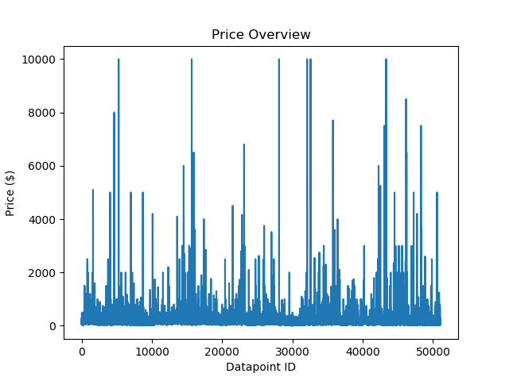

The dataset used for this project is part of the public dataset available for Airbnb [1], specifically, this is a compilation of 48895 entries spanning across 16 attributes pertaining to listing activities and metrics in New York City, 2019. 

While several columns may have little predictive values in many economic studies (ex: id, host\_id, etc.), most columns’ data are indispensable if one is to study potential relationships between different listing’s attributes, e.g., neighbourhood, room type, availability, number of reviews etc.

At the same time, the prospect for further study extends even beyond the original dataset; by expanding on certain attributes, one can possibly obtain even more economically valuable and interesting correlations. For instance, with just the data available from the “neighbourhood “ listing, one can, from various databases such as “areavibes.com”[2], acquire even more information pertaining to the corresponding neighborhood (ex: livability, amenities, cost of living, crime, weather, demographics, etc.); thus allowing for many correlations studies and impactful potential for machine learning.

The price in the dataset has a high variance, 56797.66437, and the value ranges from $10 to $10,000 with the average of $154.5136. The high variance in dataset is one of the major challenges to constrcut a machine learning models for the dataset.

We plot a Pearson correation matrix below based on our dataset to show the correlation of each feature with the price. We observe that the neighborhood information (last 10 features) we augmented to the dataset is highly correlated each other. We also observe that the location is not tightly related to the price. However, the room type, median rent, and median home price of the Airbnb location are closely related to the price.

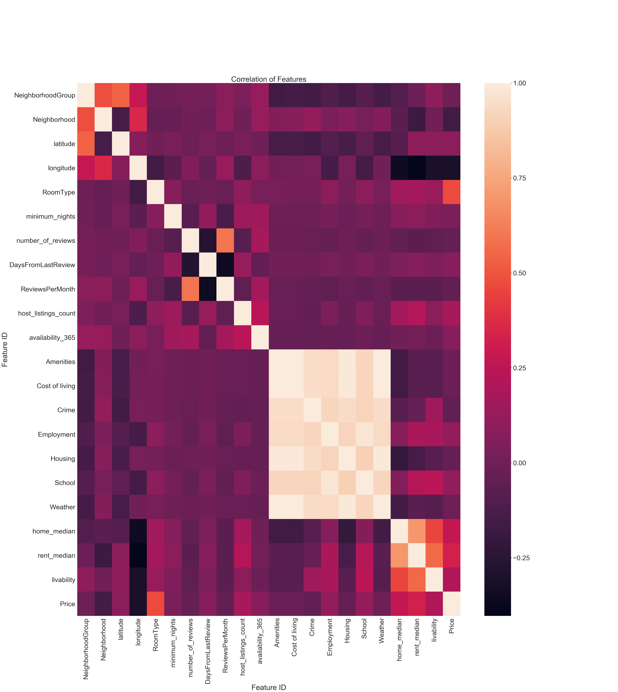

## Clustering using Gaussian Mixture Model

First, let us have a look into the Airbnb dataset by clustering the data based on Gaussian Mixture Model. We are interested in clustering these listings based on prices, reviews and availabilities.

### Clustering of prices

To choose the appropriate number of clusters, we measure and plot the Bayesian information criteria of different k in the Gaussian Mixture Model, and choose the k to be at the elbow points.

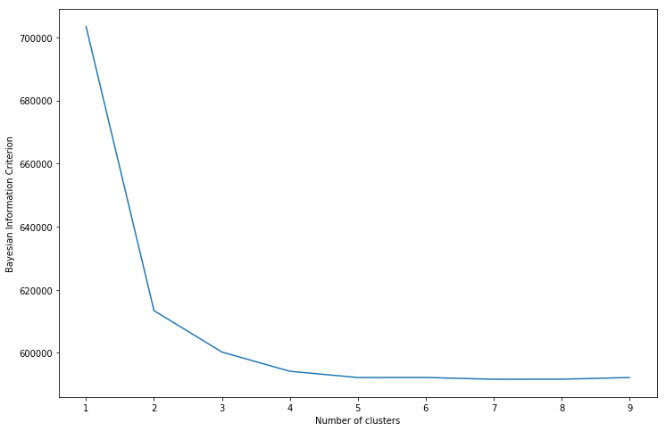

We choose the number of clusters to be 4, and calculated the cluster centers and cluster weights in the GMM model.

Clusters | Average Price | Percentage
--- | --- | ---
Red | $2136.7 | 1%
Orange | $433.1 | 7%
Green | $184.5 | 36%
Blue | $80.0 | 56%

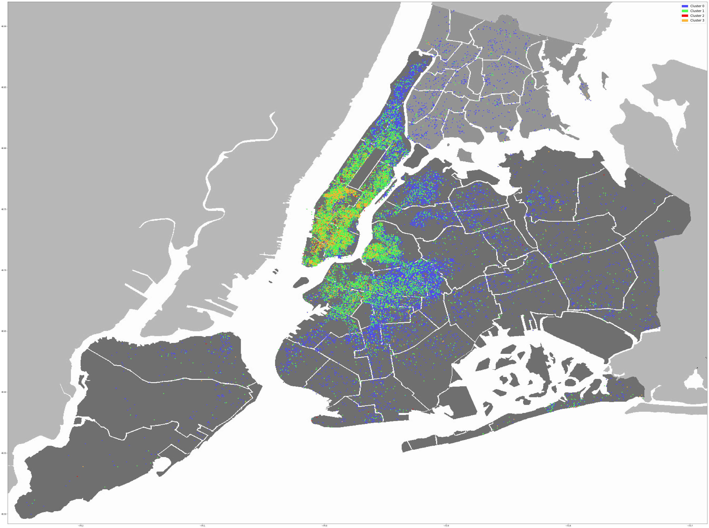

This figure demonstrates the distribution of listed properties and their prices in the city of New York. Clearly, there are more listings near the downtown, e.g, Manhatten and Brooklyn, than in the suburban areas. As expected, the prices in the downtown area is higher, and more than 90% of the listings are under 400$ per day.

### Clustering of room type

The original dataset includes 3 room types, private room, shared room and entire home/apt. The distribution of the data is plotted below.

Clusters | Room Type | Percentage
--- | --- | ---
Blue | Entire Home / Apartment | 52.3%
Orange | Private Room | 45.3%
Red | Shared Room | 2.5%

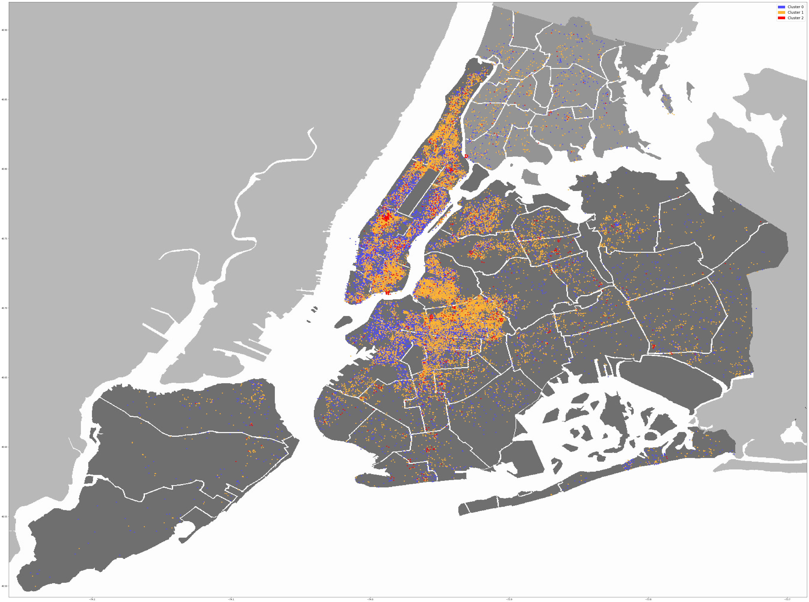

Roughly half of the listings are apartments and the other half private rooms. Shared rooms are only present in a few neighbourhoods, such as in Midtown and Harlem.

### Clustering of number of reviews

The relationship between Bayersian information critria and number of clusters is shown below.

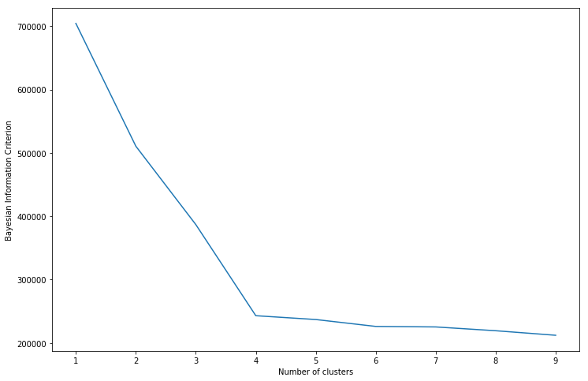

We choose the number of clusters to be also 4, and calculated the cluster centers and cluster weights in the GMM model.

Clusters | Average Reviews | Percentage
--- | --- | ---
Red | 77.2 | 23%
Orange | 15.3 | 30%
Green | 3.5 | 26%
Blue | 0.0 | 21%

There is a large variance in the number of reviews in all listings. A quarter of the listings have around 70 reviews, while a quarter receive none reviews at all. Geographically, there is not much corelation between reviews and locations - the listings in suburban areas like Bronx and Queens district seems to get more reviews on average, while the listings in the downtown area do not show any trends in number of reviews.

### Clustering of availability

The relationship between Bayersian information critria and number of clusters is shown below.

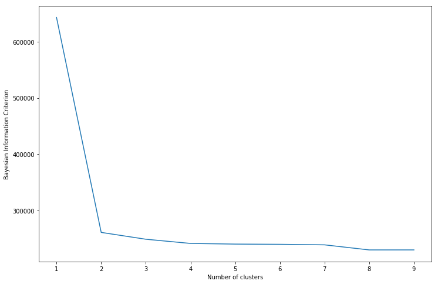

We choose the number of clusters to 2, and calculated the cluster centers and cluster weights in the GMM model.

Clusters | Average Yearly Availability | Percentage
--- | --- | ---
Orange | 176 | 64%
Green | 0.0 | 36%

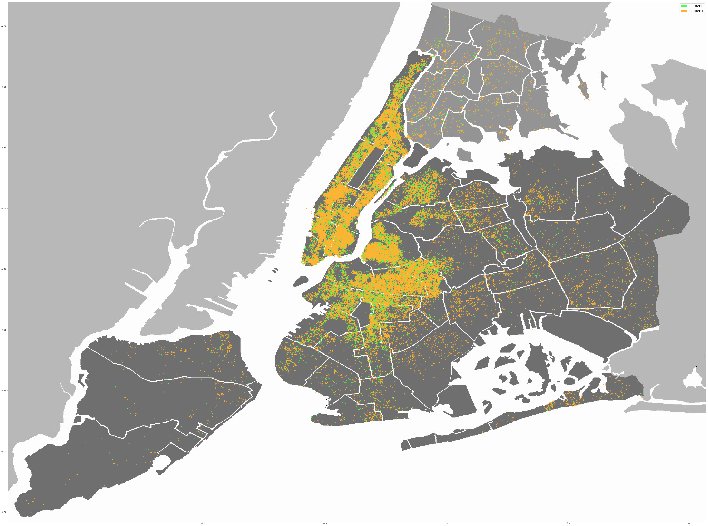

Around 36% of the properties are not available at the moment - some of listings might be closed and some might be available in only few days. From the figure above, there are more unavailable listings in the downtown area compared with suburban areas. 

## Supervised Learning

We apply linear regression, ridge regression, lasso regression, and multi-layer perceptron (MLP) to construct a model that predicts the price based on features (features in the data set + additional features about neighborhood; areavibes.com). We exclude outliers before training to increase the performance of trained model. For each supervised learning methods, we perform 10-fold cross-validation and report the average error across 10-fold runs of cross-validation. 

### Regressions

Regression Method | Mean square-root Error | Hyperparameter
--- | --- | ---
Linear | 282.03 | N/A
Ridge | 60.93 | lambda = 100
Lasso | 62.28 | alpha = 0.0001

We first explore three regerssion methods (linear, ridge, and lasso) to predict prices based on features. Since the dataset has high variance (56797.6644), linear regeression showed the worst error among three regression methods. In contrast, based on the same reason, regularized regressions (ridge and lasso) provided smaller (4.58X on average) error.

#### The Impact of Hyper Parameter Selection

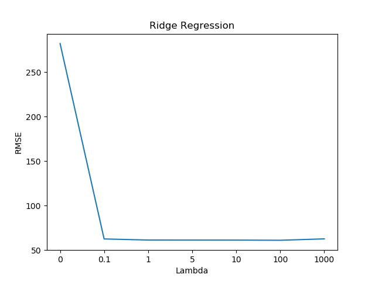 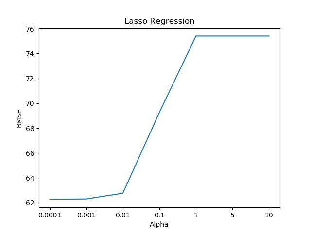

We iterate over seven values for each hyperparameter: lambda for ridge regeression and alpha for lasso regression. For lambda value, we test 0, 0.1, 1, 5, 10, 100, and 1000. For alpha value, we test 0.0001, 0.001, 0.01, 0.1, 1, 5, and 10.
The resulting MSRE values are plotted in the above figures. After iterations, we select the best hyperparameters based on the results.

### MLP

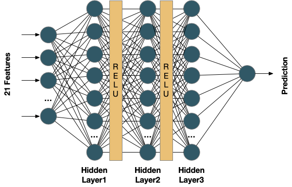

The figure above shows the structure of MLP model we applied. We construct an MLP model using three hidden layers with activation layers (ReLu) layers after the hidden layer 1 and 2. We remove the activation layer after the hidden layer 3 to enable value prediction (not classification) using this model. Unlike plain MLP models, we apply L2 regularization factor (lambda) like ridge regression does to mitigate the impact of high variance. We use mean square error (MSE) as the loss function when we train the model. We employ Adam[3], a gradient-descent training method with variable learning rate for each dimension, for training.

As hyperparameters, we modify lambda (L), the number of traning epochs (Ep), and size of hidden layers (Hs), base learning rate (R) to explore the impact of them on the test error of the model. The best setting we found after exploration is as follows:

Hyperparamter | Value
--- | --- 
L | 0.5 
Ep | 1000 
Hs | 40
R | 0.005

The RMSE using the above hyper parameters is 72.707

### The Impact of Activation Layer (ReLu)

We apply the optimal parameter we found but train another model without activation layers between hidden layers to explore the impact of the activation layer.

Model | RMSE
--- | --- 
Without ReLu | 80.450
With ReLu |  72.707

We observe applying activation layers with ReLu function reduces the error by 10.3%, which indicates the non-linearity provided by the activation layers enabled a better model to fit the training data.

### The Impact of Hidden Layer Size

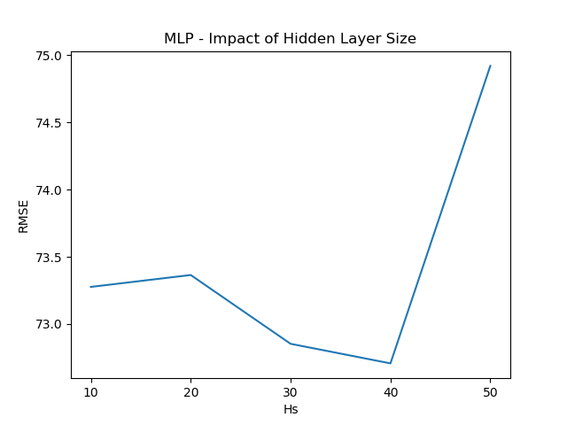

We modify the hidden layer size of our MLP model from 10 to 50 and test the error of the trained model. As the plot above shows, the best hidden layer size is 40. Larger hidden layers help in improving the accuracy until a certain point but it can degrade the performance after the point. 

In sum. the results imply that larger (or, complex) models not always improve the performance.

### The Error Over Training Epochs

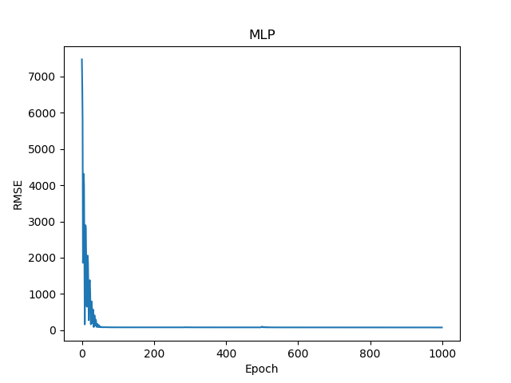

The plot above presents training RMSE over training epochs. We observe that the training error quickly converges before epoch 100. However, we found that training further helps to improve RMSE further. We found training 1000 epochs provides minimal RMSE.

### Summary of Supervised Learning

Method | Mean Square-root Error | Hyperparameter
--- | --- | ---
Linear Regression | 282.03 | N/A
Ridge Regression | 60.93 | lambda = 100
Lasso Regression | 62.28 | alpha = 0.0001
MLP | 72.707 | L = 0.5, Ep = 1000, Hs = 40, R = 0.005

To construct a model that predicts the price of AirBnB prices, we applied three regression methods and an MLP. We observe the dataset has high variance so plain linear regression does not fit the model well. Among all of methods, we observe the ridge regression performs the best since it contains direct regularization term. Considering the standard deviation value of this dataset, 238.323, all the methods other than linear regression reduced the randomness better than the standard deviation.

## Reference

[1] Dgomonov. New york city airbnb open data. [https://www.kaggle.com/dgomonov/new-york-city-airbnb-open-data](https://www.kaggle.com/dgomonov/new-york-city-airbnb-open-data), 2019

[2] AreaVibes Inc. [https://www.areavibes.com/](https://www.areavibes.com/)

[3] Kingma, Diederik P., and Jimmy Ba. "Adam: A method for stochastic optimization." arXiv preprint arXiv:1412.6980, 2014.
